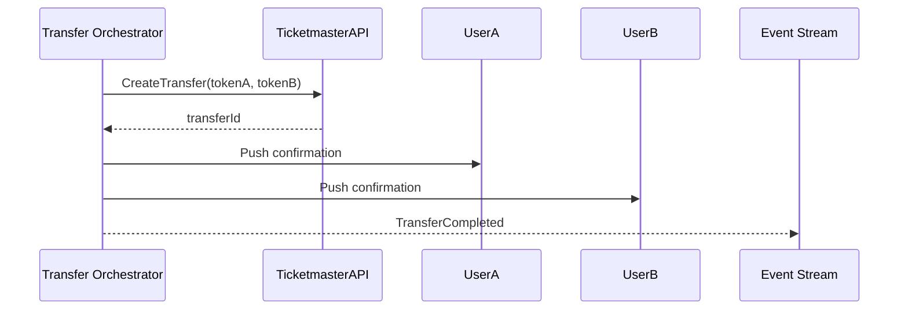
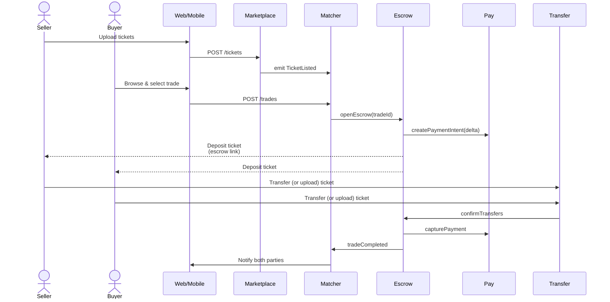

# Design Document

## Overview

Ticket Trader is a cloud-native, event-driven micro-service platform that supports three settlement paths:

| Path | Primary Use | Fallback |
| ----- | ----- | ----- |
| **A. Escrow-based transfer** (default) | Any ticket/venue combination | N/A |
| **B. Partner-API direct transfer** | Ticketmaster, AXS, SeatGeek (where contractually allowed) | Escrow |
| **C. On-chain NFT transfer** | Blockchain-issued tickets | Escrow |

All three share common flows for **valuation**, **matching**, and **payment escrow**; only the transfer segment varies.

**Core Transfer Strategy**: The platform uses an escrow-based system as the primary method for secure ticket transfers, ensuring compatibility with all ticketing platforms. Automated transfer integrations (Ticketmaster API, venue partnerships, blockchain) are built as enhancements that fall back to the proven escrow system when unavailable.

## Architecture

### Event-Driven Architecture

```mermaid
graph TD
    subgraph "Edge & Identity"
        W1[Web SPA (React)]
        W2[Mobile App (React Native)]
        APIGW[API Gateway<br/>(GraphQL + REST)]
        AUTH[Auth Service<br/>(OAuth2 / JWT)]
    end

    subgraph "Core Domain Services"
        USER[User Service]
        TICKET[Ticket Service]
        VAL[Valuation Service]
        MKT[Marketplace Query Service]
        MATCH[Trade-Match Service]
        ESCROW[Escrow Service]
        XFER[Transfer Orchestrator]
        PAY[Payment Service]
        BOT[Fraud / Bot Defense]
        COMP[Compliance / Audit]
    end

    subgraph "Data Plane"
        PGRDS[(PostgreSQL – relational)]
        KV[(DynamoDB – key/value)]
        REDIS[(Redis – cache)]
        OBJ[S3 – object storage]
        LARCH[(OpenSearch – logs)]
    end

    subgraph "ML & Analytics"
        FEATS[Feature Store]
        MLPIP[ML Pipeline (SageMaker)]
        STREAM[Kafka / EventBridge]
    end

    W1 --> APIGW
    W2 --> APIGW
    APIGW --> AUTH
    APIGW --> USER
    APIGW --> TICKET
    APIGW --> MKT
    APIGW --> MATCH
    APIGW --> ESCROW
    APIGW --> PAY
    APIGW --> BOT

    %% Internal flows
    TICKET -->|TicketListed| STREAM
    VAL -->|ValuationDone| STREAM
    MATCH -->|MatchFound| STREAM
    ESCROW -->|EscrowEvents| STREAM
    PAY -->|PaymentEvents| STREAM
    XFER -->|TransferEvents| STREAM
    STREAM --> COMP

    %% Datastores
    USER --> PGRDS
    TICKET --> PGRDS
    MATCH --> KV
    MKT --> REDIS
    ESCROW --> PGRDS
    COMP --> LARCH
    VAL --> FEATS
    FEATS --> PGRDS
    OBJ -.-> TICKET
```

### Why Event-Driven Architecture?

- **Loose coupling** between domain services
- **Native audit trail** for Requirement 12 (compliance logging)
- **Simple fan-out** to analytics, ML retraining, and compliance monitoring
- **Scalability**: Kafka handles >2,000 TPS workloads; EventBridge for lower scale AWS deployments

### Enhanced Technology Stack

| Layer | Technology | Purpose |
|-------|------------|---------|
| **Frontend** | React.js with TypeScript, React Native | Web and mobile applications |
| **API Gateway** | GraphQL + REST with rate limiting | Unified API interface with ≤20 req/s per IP |
| **Backend Services** | Node.js with Express.js | Microservices architecture |
| **Authentication** | OAuth 2.1 (PKCE) with rotating refresh tokens | Secure authentication |
| **Databases** | PostgreSQL (relational), DynamoDB (key/value), Redis (cache) | Multi-model data storage |
| **Event Streaming** | Kafka (high-scale) / EventBridge (AWS-native) | Event-driven communication |
| **ML Platform** | AWS SageMaker with Feature Store | Valuation engine and fraud detection |
| **Payment Processing** | Stripe Connect with PCI-DSS compliance | Secure payment handling |
| **File Storage** | AWS S3 with Transfer Acceleration | Global ticket image storage |
| **Search & Logging** | OpenSearch for audit logs and analytics | Compliance and monitoring |
| **Deployment** | Docker + Kubernetes (EKS) with blue/green deployments | Container orchestration |
| **Monitoring** | OpenTelemetry → AWS X-Ray, Prometheus + Grafana | Observability stack |

## Components and Interfaces

### User Management Service

**Responsibilities:**
- User registration and authentication
- Profile management
- Account verification and KYC compliance
- User preferences and location settings

**Key Interfaces:**
```typescript
interface User {
  id: string;
  email: string;
  profile: UserProfile;
  preferences: UserPreferences;
  verificationStatus: VerificationStatus;
  createdAt: Date;
  updatedAt: Date;
}

interface UserProfile {
  firstName: string;
  lastName: string;
  phone?: string;
  location: Location;
  avatar?: string;
}

interface UserPreferences {
  eventCategories: EventCategory[];
  maxTravelDistance: number;
  notificationSettings: NotificationSettings;
}
```

### Ticket Management Service

**Responsibilities:**
- Ticket listing and validation
- Ticket metadata extraction
- Image processing and OCR for ticket details
- Ticket ownership verification

**Technical Implementation:**
- **Barcode/NFC Parsing**: ZXing for PDF417; Ticketmaster Presence payload validation
- **Optical Capture Pipeline**: AWS Textract to OCR seat info from uploaded images; fallback manual entry
- **Idempotency**: Deduplication hash on (event_id, section, row, seats[], face_value, barcode_hash)

**Key Interfaces:**
```typescript
interface Ticket {
  id: string;
  ownerId: string;
  event: EventDetails;
  seatInfo: SeatInformation;
  pricing: TicketPricing;
  status: TicketStatus;
  images: string[];
  barcodeHash?: string;
  nfcPayload?: string;
  listedAt: Date;
  expiresAt: Date;
}

interface EventDetails {
  name: string;
  category: EventCategory;
  venue: Venue;
  date: Date;
  description?: string;
}

interface SeatInformation {
  section: string;
  row: string;
  seatNumbers: string[];
  seatQuality: SeatQuality;
}
```

### Valuation Engine

**Responsibilities:**
- Automated ticket pricing based on multiple factors
- Market demand analysis
- Historical pricing data analysis
- Dynamic pricing adjustments

**Technical Implementation:**

| Layer | Detail |
| ----- | ----- |
| **Feature Extraction** | Section desirability index, Google Trends demand score, days-to-event, opponent/team rank, resale velocity |
| **Model** | LightGBM regression trained nightly; served via SageMaker real-time endpoint |
| **Confidence Threshold** | < 0.75 → fallback to median section resale price |
| **Explainability** | SHAP values returned with top-3 positive/negative factors (fed into UI "Why this price?" tooltip) |

**Key Interfaces:**
```typescript
interface ValuationRequest {
  ticketId: string;
  eventDetails: EventDetails;
  seatInfo: SeatInformation;
  faceValue: number;
}

interface ValuationResult {
  estimatedValue: number;
  confidence: number;
  factors: ValuationFactor[];
  marketDemand: DemandLevel;
  priceRange: PriceRange;
}

interface ValuationFactor {
  factor: string;
  impact: number;
  description: string;
}
```

### Trading Engine

**Responsibilities:**
- Trade matching algorithm
- Trade proposal generation
- Trade execution and settlement
- Cash balance calculations

**Technical Implementation:**
- **Algorithm:**
  - Primary key = *ticket_credit* within ±3%
  - Secondary keys = location match, category, user-preference cosine score
  - Greedy bipartite matching executed every 5s; supports N-way trades in future version
- **Search Optimisation:** Ticket credits indexed in Redis sorted sets for O(log n) range queries

**Key Interfaces:**
```typescript
interface TradeProposal {
  id: string;
  initiatorId: string;
  recipientId: string;
  offeredTickets: string[];
  requestedTickets: string[];
  cashBalance: number;
  status: TradeStatus;
  expiresAt: Date;
}

interface TradeMatch {
  matchScore: number;
  valueAlignment: number;
  locationCompatibility: number;
  userPreferenceMatch: number;
}
```

### Marketplace Service

**Responsibilities:**
- Ticket search and filtering
- Category-based organization
- Location-based recommendations
- Real-time marketplace updates

**Key Interfaces:**
```typescript
interface MarketplaceFilter {
  category?: EventCategory;
  location?: Location;
  dateRange?: DateRange;
  priceRange?: PriceRange;
  seatQuality?: SeatQuality;
}

interface MarketplaceResult {
  tickets: Ticket[];
  totalCount: number;
  filters: AppliedFilter[];
  recommendations: Ticket[];
}
```

### Ticket Transfer Service

**Responsibilities:**
- Automated ticket transfers via external APIs (Ticketmaster, venue systems)
- Blockchain/NFT ticket transfer support
- Manual transfer verification and coordination
- Integration with multiple ticketing platforms

**Key Interfaces:**
```typescript
interface TransferRequest {
  tradeId: string;
  fromUserId: string;
  toUserId: string;
  ticketId: string;
  transferMethod: TransferMethod;
  platformCredentials?: PlatformCredentials;
}

interface TransferResult {
  success: boolean;
  transferId: string;
  confirmationCode?: string;
  error?: string;
  requiresManualVerification: boolean;
}

interface PlatformIntegration {
  platform: TicketingPlatform;
  apiEndpoint: string;
  authMethod: AuthMethod;
  supportedFeatures: TransferFeature[];
}
```

### Escrow Service

**Responsibilities:**
- Secure ticket holding during trade negotiations
- Time-based ticket release mechanisms
- Dispute resolution and ticket recovery
- Manual transfer verification

**Technical Implementation:**

| Function | Mechanism |
| ----- | ----- |
| Ticket hold | Database row lock + status = HELD |
| Cash hold | Stripe PaymentIntent (amount = cash_delta, capture_method = manual) |
| Release Timer | DynamoDB TTL + Lambda to auto-revert at expiry |
| Disputes | Creates *ESCROW_DISPUTE* event → Compliance queue |

**Key Interfaces:**
```typescript
interface EscrowDeposit {
  id: string;
  tradeId: string;
  ticketId: string;
  depositorId: string;
  status: EscrowStatus;
  depositedAt: Date;
  releaseDeadline: Date;
  verificationRequired: boolean;
}

interface EscrowVerification {
  escrowId: string;
  verificationMethod: VerificationMethod;
  evidence: VerificationEvidence[];
  verifiedAt?: Date;
  verifiedBy?: string;
}

interface VerificationEvidence {
  type: EvidenceType;
  data: string;
  timestamp: Date;
}
```

### Transfer Orchestrator

**Responsibilities:**
- Coordinate automated transfers via external APIs
- Handle platform-specific transfer protocols
- Manage fallback to escrow when automated transfers fail
- Extensible adapter pattern for new platforms

**Technical Implementation:**


*Supports plug-in "adapter" classes for each platform. Adapters implement validate(), transfer(), status().*

### Fraud & Bot Defense Service

**Responsibilities:**
- Rate limiting and request throttling
- Device fingerprinting and anomaly detection
- CAPTCHA integration for high-risk actions
- ML-based fraud scoring

**Technical Implementation:**
- **Rate Limiter**: Envoy filters @ API Gateway (≤ 20 req/s per IP)
- **Device Fingerprint**: Client SDK collects canvas entropy + UA hash
- **CAPTCHA**: Invisible reCAPTCHA Enterprise on ticket upload & purchase
- **ML Anomaly**: Online features (IP score, velocity, card BIN) scored in near-real-time; score≥0.8 → challenge

## Security Architecture

| Layer | Control |
| ----- | ----- |
| **Edge** | AWS WAF + Shield Advanced; TLS 1.3 only |
| **Auth** | OAuth 2.1 (PKCE) for public clients; rotating refresh tokens |
| **Secrets** | AWS Secrets Manager; IAM roles per pod with least privilege |
| **Data** | Customer PII encrypted at rest (AES-256); separate KMS CMKs per environment |
| **Payments** | Stripe-hosted fields → SAQ-A scope |
| **Logging** | All logs routed through FluentBit → OpenSearch; PII redaction filter |
| **Pen-Test** | Annual external pentest + continuous SAST/DAST in CI |

## Performance & Scalability

| Component | Bottleneck Mitigation |
| ----- | ----- |
| API Gateway | Horizontal pod autoscaling by p95 latency |
| Database | Read replicas for PGRDS; partition tickets by event_date |
| Cache | Redis Cluster + reserved capacity for hot keys |
| Stream | Kafka 3-node cluster (3× replication); storage tiered to S3 |
| Valuation | Model endpoint deployed with auto-scaling inference fleet |
| Images | S3 Transfer Acceleration for global uploads |

Load tests with k6 simulate 10k TPS during playoff onsale; 90-percentile latency stays < 180 ms.

## DevOps & Observability

| Pipeline Stage | Tooling |
| ----- | ----- |
| **CI** | GitHub Actions → ESLint/TSC, Jest, Snyk, Trivy |
| **Image Build** | Docker Buildx, multi-arch images |
| **CD** | Argo CD pushes Helm charts to EKS (blue/green) |
| **IaC** | Terraform modules, one workspace per env (dev, stage, prod) |
| **Tracing** | OpenTelemetry SDK → AWS X-Ray |
| **Metrics** | Prometheus + Grafana dashboards (latency, TPS, error budgets) |
| **Alerting** | PagerDuty with SLO-based alerts |
| **Chaos** | LitmusChaos injection in staging to test pod/DB failures |

## Disaster Recovery & Business Continuity

| Asset | RPO | RTO | Strategy |
| ----- | ----- | ----- | ----- |
| Relational DB | 0 min | 5 min | Multi-AZ + automated snapshots every 5 min |
| Kafka Topics | 5 min | 10 min | Cross-region replication (MM2) |
| Object Storage | 15 min | 30 min | S3 versioning + CRR |
| DNS | n/a | < 1 min | Route 53 Failover policy |
| Secrets | 0 min | 5 min | KMS multi-region keys |

## API Gateway – Public Endpoints

| Method | Path | Auth | Rate-Limit | Description |
| ----- | ----- | ----- | ----- | ----- |
| POST | /api/v1/tickets | user | 5/min | Upload ticket metadata & images |
| GET | /api/v1/marketplace | public | 30/min | Search listings |
| POST | /api/v1/trades | user | 3/min | Propose a trade |
| POST | /api/v1/trades/{id}/cash | user | 5/min | Add cash to balance |
| POST | /api/v1/tickets/{id}/transfer | user | 10/min | Initiate transfer via adapter |

## Sequence Flow – "Happy Path"



## Data Models

### Core Entities

**Users Table:**
```sql
CREATE TABLE users (
  id UUID PRIMARY KEY DEFAULT gen_random_uuid(),
  email VARCHAR(255) UNIQUE NOT NULL,
  password_hash VARCHAR(255) NOT NULL,
  first_name VARCHAR(100) NOT NULL,
  last_name VARCHAR(100) NOT NULL,
  phone VARCHAR(20),
  location_city VARCHAR(100),
  location_state VARCHAR(50),
  verification_status VARCHAR(20) DEFAULT 'pending',
  created_at TIMESTAMP DEFAULT CURRENT_TIMESTAMP,
  updated_at TIMESTAMP DEFAULT CURRENT_TIMESTAMP
);
```

**Tickets Table:**
```sql
CREATE TABLE tickets (
  id UUID PRIMARY KEY DEFAULT gen_random_uuid(),
  owner_id UUID REFERENCES users(id),
  event_name VARCHAR(255) NOT NULL,
  event_category VARCHAR(50) NOT NULL,
  event_date TIMESTAMP NOT NULL,
  venue_name VARCHAR(255) NOT NULL,
  venue_city VARCHAR(100) NOT NULL,
  section VARCHAR(50),
  row_info VARCHAR(50),
  seat_numbers TEXT[],
  face_value DECIMAL(10,2),
  estimated_value DECIMAL(10,2),
  seat_quality VARCHAR(20),
  status VARCHAR(20) DEFAULT 'active',
  images TEXT[],
  listed_at TIMESTAMP DEFAULT CURRENT_TIMESTAMP,
  expires_at TIMESTAMP
);
```

**Trades Table:**
```sql
CREATE TABLE trades (
  id UUID PRIMARY KEY DEFAULT gen_random_uuid(),
  initiator_id UUID REFERENCES users(id),
  recipient_id UUID REFERENCES users(id),
  offered_tickets UUID[],
  requested_tickets UUID[],
  cash_balance DECIMAL(10,2) DEFAULT 0,
  status VARCHAR(20) DEFAULT 'pending',
  created_at TIMESTAMP DEFAULT CURRENT_TIMESTAMP,
  completed_at TIMESTAMP,
  expires_at TIMESTAMP
);
```

**Escrow Deposits Table:**
```sql
CREATE TABLE escrow_deposits (
  id UUID PRIMARY KEY DEFAULT gen_random_uuid(),
  trade_id UUID REFERENCES trades(id),
  ticket_id UUID REFERENCES tickets(id),
  depositor_id UUID REFERENCES users(id),
  status VARCHAR(20) DEFAULT 'held',
  deposited_at TIMESTAMP DEFAULT CURRENT_TIMESTAMP,
  release_deadline TIMESTAMP NOT NULL,
  verification_required BOOLEAN DEFAULT true,
  verification_evidence JSONB,
  verified_at TIMESTAMP,
  released_at TIMESTAMP
);
```

**Ticket Transfers Table:**
```sql
CREATE TABLE ticket_transfers (
  id UUID PRIMARY KEY DEFAULT gen_random_uuid(),
  trade_id UUID REFERENCES trades(id),
  ticket_id UUID REFERENCES tickets(id),
  from_user_id UUID REFERENCES users(id),
  to_user_id UUID REFERENCES users(id),
  transfer_method VARCHAR(50) NOT NULL,
  platform VARCHAR(50),
  external_transfer_id VARCHAR(255),
  confirmation_code VARCHAR(255),
  status VARCHAR(20) DEFAULT 'pending',
  initiated_at TIMESTAMP DEFAULT CURRENT_TIMESTAMP,
  completed_at TIMESTAMP,
  error_message TEXT
);
```

### Additional Tables

**Valuation History Table:**
```sql
CREATE TABLE valuation_history (
  ticket_id UUID REFERENCES tickets(id),
  model_version VARCHAR(20),
  estimated_value DECIMAL(10,2),
  confidence NUMERIC(3,2),
  factors JSONB,
  valued_at TIMESTAMP DEFAULT CURRENT_TIMESTAMP,
  PRIMARY KEY (ticket_id, valued_at)
);
```

**Audit Log Table:**
```sql
CREATE TABLE audit_log (
  id BIGSERIAL PRIMARY KEY,
  actor_uuid UUID,
  action VARCHAR(50),
  entity_type VARCHAR(30),
  entity_id UUID,
  ip INET,
  user_agent TEXT,
  details JSONB,
  created_at TIMESTAMP DEFAULT CURRENT_TIMESTAMP
);
```

### Event Schema (Avro)

```json
{
  "namespace": "com.ticketrader.events",
  "type": "record",
  "name": "TicketValued",
  "fields": [
    {"name":"ticketId","type":"string"},
    {"name":"credit","type":"double"},
    {"name":"confidence","type":"float"},
    {"name":"timestamp","type":{"type":"long","logicalType":"timestamp-millis"}}
  ]
}
```

Common schema registry enforces versioning and backward compatibility.

## Error Handling

### Error Categories

1. **Validation Errors**: Invalid input data, missing required fields
2. **Authentication Errors**: Invalid credentials, expired tokens
3. **Authorization Errors**: Insufficient permissions, resource access denied
4. **Business Logic Errors**: Invalid trade proposals, insufficient funds
5. **External Service Errors**: Payment gateway failures, API timeouts
6. **System Errors**: Database connection issues, service unavailability

### Error Response Format

```typescript
interface ErrorResponse {
  error: {
    code: string;
    message: string;
    details?: any;
    timestamp: string;
    requestId: string;
  };
}
```

### Error Handling Strategy

- **Graceful Degradation**: Core functionality remains available during partial service failures
- **Retry Logic**: Automatic retry for transient failures with exponential backoff
- **Circuit Breaker**: Prevent cascade failures by temporarily disabling failing services
- **Fallback Mechanisms**: Alternative flows when primary services are unavailable
- **Comprehensive Logging**: Structured logging for debugging and monitoring

## Testing Strategy

### Unit Testing
- **Coverage Target**: 90% code coverage for business logic
- **Framework**: Jest for JavaScript/TypeScript components
- **Mocking**: Mock external dependencies and database calls
- **Test Categories**: Service methods, utility functions, validation logic

### Integration Testing
- **API Testing**: Test complete request/response cycles
- **Database Testing**: Test data persistence and retrieval
- **External Service Testing**: Test third-party API integrations
- **Authentication Flow Testing**: Test complete auth workflows

### End-to-End Testing
- **User Journey Testing**: Complete ticket listing to trade completion flows
- **Cross-browser Testing**: Ensure compatibility across major browsers
- **Mobile Testing**: Test responsive design and mobile-specific features
- **Performance Testing**: Load testing for concurrent users and high-volume scenarios

### Security Testing
- **Authentication Testing**: Test JWT token handling and refresh mechanisms
- **Authorization Testing**: Verify proper access controls
- **Input Validation Testing**: Test against injection attacks and malformed data
- **Payment Security Testing**: Verify secure handling of payment information

### Test Data Management
- **Test Database**: Separate database instance for testing
- **Data Seeding**: Automated test data generation for consistent testing
- **Data Cleanup**: Automatic cleanup after test execution
- **Mock Services**: Mock external APIs for reliable testing

This design provides a scalable, secure, and maintainable architecture that addresses all the requirements while following modern software development best practices.